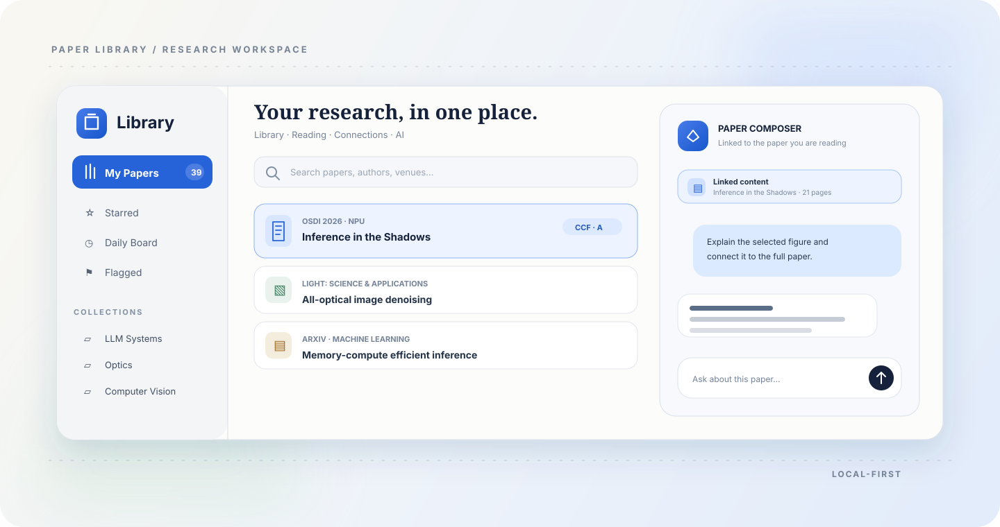

<div align="center">



# Paper Library

### 把论文管理、深度阅读与 AI 对话，放进同一个 Obsidian Vault。

从收藏论文到勾画原文，从连接想法到追问整篇文档。一个插件，一条完整的研究工作流。

[](https://github.com/Lyle-xub/obsidian-paper-library/releases)
[](https://obsidian.md)
[](#平台支持)
[](LICENSE)

[下载安装](#安装) · [核心能力](#一个-vault完整覆盖研究流程) · [Paper Composer](#paper-composer) · [本地解析](#两种文档上下文模式) · [开发](#开发)

</div>

---

## 研究不该散落在五个应用里

Paper Library 将资料库、阅读器、可视化研究空间和智能对话整合为 Obsidian 原生工作区。论文、笔记、标注与关系数据保留在你的 Vault 中；阅读时产生的上下文，可以直接进入 Paper Composer，而不必反复复制、解释文件来源或重新上传。

<table>
  <tr>
    <td width="33%" valign="top">
      <h3>01 · Organize</h3>
      <p><strong>建立真正属于你的论文库</strong></p>
      <p>集中管理论文、附件、作者、会议、标签、分类、评分、引用与阅读状态。</p>
    </td>
    <td width="33%" valign="top">
      <h3>02 · Read</h3>
      <p><strong>让阅读痕迹成为知识结构</strong></p>
      <p>勾画、画线、摘录、卡片与连线在原生阅读器和研究空间之间保持同步。</p>
    </td>
    <td width="33%" valign="top">
      <h3>03 · Compose</h3>
      <p><strong>带着整篇论文追问 AI</strong></p>
      <p>文字、图片、页面区域和研究节点均可成为 linked content，并与全文语境联动。</p>
    </td>
  </tr>
</table>

## 一个 Vault，完整覆盖研究流程

### Library · 为论文建立秩序

- Obsidian 原生三栏布局：左侧导航、中央论文库、右侧详情。
- Starred、Daily Board、Recently Read、Flagged、Tags 与层级 Collections。
- 拖入文档后提取本地元数据，并可通过 DOI、arXiv 或标题补全信息。
- 自动识别期刊与会议信息，支持 CCF、JCR、影响因子和会议录用率。
- 管理论文主文件、补充材料、Markdown 阅读笔记及引用关系。
- APA、IEEE、Chicago、MLA、Harvard、Vancouver 等引用预览与导出。
- 标准、画廊、纸境、蓝图和自定义外观，桌面端与移动端可分别选择。

### Research Workspace · 把阅读变成可连接的思考

- 双击论文进入单一可视化研究空间，连续加载文档页面。
- 将原文选区拖成摘录卡，也可创建想法卡和主题卡。
- 卡片四边均可建立连接，支持移动、缩放、搜索和自动整理。
- 荧光笔与自由画笔实时显示；研究空间与 Obsidian 原生阅读器共用同一份标注数据。
- 标注、笔迹、卡片和来源链接会随论文重命名或目录调整自动迁移。
- 识别论文中的图片并提供目录、轮播、缩放、全屏、图注与 PNG 下载。
- 研究结果同步写入论文 Markdown 笔记，便于搜索、引用和长期保存。

### Ask AI · 选中什么，就从什么开始问

- 拖入论文、Markdown、文字选区、图片或研究节点。
- 圈选页面区域后，以图片形式加入当前对话。
- 右键文字、图片、论文卡片或中间栏论文即可添加到 Paper Composer。
- 所有上下文以清晰的小卡片展示，不向消息正文暴露内部标签或元数据。
- Linked content 在欢迎区和输入框中持续可见，并可随时移除。

## Paper Composer

Paper Composer 是 Paper Library 内置的智能写作与研究侧栏。它与其他插件实例隔离，只保留 Paper Library 自己的视图、会话和右键入口。

<table>
  <tr>
    <td width="50%" valign="top">
      <h3>像编辑器一样工作</h3>
      <ul>
        <li>多标签对话与历史记录</li>
        <li>Inline Edit 与 Plan Mode</li>
        <li><code>@</code> 文件引用与斜杠命令</li>
        <li>Skills、MCP、Vault Agent 与检查点</li>
        <li>适配窄侧边栏的紧凑输入界面</li>
      </ul>
    </td>
    <td width="50%" valign="top">
      <h3>连接你已经使用的模型</h3>
      <ul>
        <li>使用官方命令行工具完成账号授权</li>
        <li>ChatGPT / OpenAI Codex 与 Claude Code</li>
        <li>自动识别本地 Kimi CLI</li>
        <li>按 Provider 启用多个模型</li>
        <li>按模型显示推理强度与可用加速能力</li>
      </ul>
    </td>
  </tr>
</table>

> Paper Library 不保存第三方 OAuth token。登录与授权由对应的官方命令行工具管理。

## 两种文档上下文模式

在输入框上方的设置按钮中，可以随时为当前 linked content 选择处理方式。

| 模式 | 工作方式 | 适合场景 |
|---|---|---|
| **源文件** | 将完整源文件交给当前 AI；这是默认模式 | 模型原生支持文件、多模态理解或需要完整格式时 |
| **本地解析** | 在本机依次完成版面、文字、表格与公式处理，并生成结构化 Markdown | 希望复用解析缓存、减少重复处理或获得稳定文本结构时 |

文档正文只在当前会话首次建立 linked content 时注入一次；后续消息复用既有上下文，不会每轮重复发送全文或重复检索。解析结果会保存在本地缓存中，卡片实时显示阶段、进度和预计时间。

本地运行时与模型按需下载，不随插件仓库分发，也不依赖 PyTorch。组件缺失时不会伪装成本地解析成功，仍可切换回源文件模式继续使用。

## 一条自然的工作流

```text
收集论文 → 整理元数据与分类 → 阅读并勾画
        → 拖出摘录 / 图片 / 区域 → 连接研究卡片
        → 绑定为 linked content → 结合全文继续追问
```

1. 把本地文件拖入中央论文库，确认自动识别的元数据。
2. 双击论文进入研究空间，或直接使用 Obsidian 原生阅读器。
3. 勾画文字、用自由画笔标记，或者把选区拖成研究卡片。
4. 右键或拖动内容到 Paper Composer；论文自动成为 linked content。
5. 继续提问。当前会话会保留文档关系，而不会每轮重新附带完整正文。

## 安装

### 通过 BRAT 安装

1. 在 Obsidian 的「设置 → 第三方插件 → 浏览」中安装并启用 [BRAT](https://github.com/TfTHacker/obsidian42-brat)。
2. 打开命令面板，运行 `BRAT: Add a beta plugin for testing`。
3. 粘贴仓库地址：`https://github.com/Lyle-xub/obsidian-paper-library`。
4. BRAT 安装完成后，在「设置 → 第三方插件」中启用 **Paper Library**。
5. 点击左侧 ribbon 的 Library 图标，或运行命令 `Open paper library`。

后续版本可直接通过 BRAT 检查并安装更新。

## 浏览器一键导入

仓库中的 `browser-extension/` 提供 Chrome / Edge 扩展：

- 在开放获取页面查找并导入论文文件。
- 复用浏览器现有登录状态处理订阅网站。
- 已入库论文直接显示本地分类、指标和引用信息。
- 通过仅监听本机的服务与 Paper Library 通信。

在扩展管理页面开启开发者模式，加载 `browser-extension/`，随后在 Paper Library 设置中启用浏览器扩展服务并复制配对 Token。详细说明见 [browser-extension/README.md](browser-extension/README.md)。

## 平台支持

| 能力 | 桌面端 | iOS / Android |
|---|:---:|:---:|
| 论文库、详情、分类与标签 | ✓ | ✓ |
| 原生阅读标注与 Markdown 同步 | ✓ | ✓ |
| 可视化研究空间 | ✓ | ✓ |
| Paper Composer 完整 Agent 能力 | ✓ | — |
| 本地版面与图片识别 | ✓ | — |

移动端采用更低的页面渲染倍率和紧凑工具栏，以降低 WebView 内存压力。桌面与移动端外观设置互不覆盖。

## 开发

```bash
npm run check
npm test
```

- [外观协议与自定义主题](APPEARANCE_API.md)
- [浏览器扩展开发说明](browser-extension/README.md)
- `demo.html` 是独立 UI 预览，不读写 Vault 数据。

发布目录固定包含第三方运行时的许可与来源说明。`pdf-lib` 依据 MIT 许可证随插件分发，用于安全解析和更新本地批注。

## License

[MIT](LICENSE) © 2026 Lyle

<div align="center">

<sub>Built for long papers, messy questions, and the moment one note finally connects to another.</sub>

</div>
